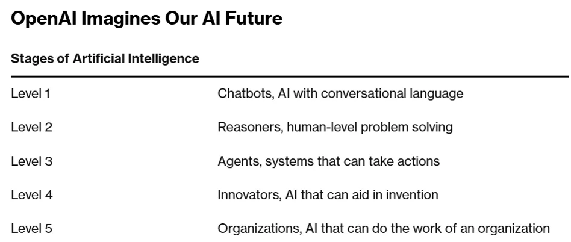

OpenAI对AGI分级    
---
**2024年7月，OpenAI在一次内部会议上提出了AGI的分级系统，这一分级系统从L1到L5，目的在于衡量大语言模型的智能水平。**

##### L1: 聊天机器人（Chatbots）,能够使用自然语言进行对话的人工智能；
##### L2: 推理者（Reasoners）,可以解决人类级别问题的人工智能；
##### L3: 智能主体（Agents），能够代表用户采取行动的人工智能；
##### L4: 创新者（Innovators）,能助力发明创新的人工智能；
##### L5: 组织（Organizations）,能够执行复杂组织任务的人工智能。

OpenAI对AGI的定义：一种高度自主的系统，在大多数具有经济价值的任务上的表现能够超越人类。  
目前状态：目前openai所处的状态是接近L2，目前人工智能系统能展示出强大的与phd相当的推理能力。    
最终目标：L5是实现通用人工智能最后一步，到达L5级别意味着实现可以执行负责组织任务的人工智能。 

参考资料：  
https://mp.weixin.qq.com/s/wrOA5PtEWmkq4z-Tv04eNw  
https://www.doit.com.cn/p/515543.html  
